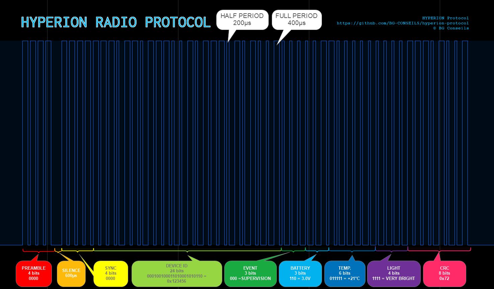

# HYPERION PROTOCOL

**Lightweight radio transmission protocol for HYPERION IoT sensors using OOK modulation in the 433 MHz or 868 MHz ISM bands.**

**Author:** Bruno GAVAND — bruno@gavand.com
**Date:** March 2026
**License:** [MIT](https://opensource.org/licenses/MIT)

---

## 📌 Overview

HYPERION PROTOCOL is designed for **ultra-low power wireless sensors** with the following objectives:

- ✅ **Robustness against noise**
- ✅ **Very low energy consumption**
- ✅ **Low channel occupancy**
- ✅ **Anti-collision resistance**
- ✅ **Easy implementation on small microcontrollers**
- ✅ **Minimal memory footprint**

The protocol uses:
- **OOK (On-Off Keying) modulation**
- **Pulse length encoding**
- **Fixed-length 52-bit frames**

---

## 📡 Physical Layer

### Frequency Bands
- **433 MHz ISM**
- **868 MHz ISM** *(Region dependent)*

### Modulation
- **OOK (On-Off Keying)**
  - Logic **1** → Carrier **ON**
  - Logic **0** → Carrier **OFF**

---

## ⏱ Bit Timing

### Definitions
- `HALF_PERIOD` = Configurable (example: **200 µs**)
- `FULL_PERIOD` = **2 × HALF_PERIOD** (example: **400 µs**)

---

## 🔁 Bit Encoding (Pulse Length Encoding)

Each bit consists of two time segments:

| Logical Bit | Level 1 Duration | Level 0 Duration |
|-------------|------------------|------------------|
| **1**       | HALF_PERIOD         | FULL_PERIOD         |
| **0**       | FULL_PERIOD         | HALF_PERIOD         |

### Properties
- Constant total bit time
- Good synchronization behavior
- Simple decoding logic
- Compatible with low-cost RF receivers

---

## 🧱 Frame Structure

- **Total frame length:** 56 bits + preamble silence
- **Layout:** `[4 bits preamble] + [silence] + [4 bits sync] + [48 bits payload]`

---

## 🧩 Detailed Frame Layout

### 1️⃣ Preamble (4 bits)
- **Value:** `0000`
- **Purpose:** Allows the radio receiver to calibrate its gain

### 2️⃣ Silence
- **Radio silence** for the duration of one complete bit: `HALF_PERIOD + FULL_PERIOD`
- Example: 200 µs + 400 µs = **600 µs** of silence
- **Purpose:** Marks the boundary between preamble and data, allowing the receiver to distinguish the start of payload

### 3️⃣ Synchronization (4 bits)
- **Value:** `0000`
- **Purpose:** Allows the decoding logic to determine the bit and half-bit duration

### 4️⃣ Payload (48 bits)

| Field       | Size (bits) | Description                |
|-------------|-------------|----------------------------|
| Device ID   | 24          | Unique identifier          |
| Event       | 3           | Event type                 |
| Battery     | 3           | Voltage encoding           |
| Temperature | 6           | Temperature encoding       |
| Light       | 4           | Luminosity encoding        |
| CRC         | 8           | CRC-8 checksum             |

**Transmission order:** MSB first

---

## 🆔 Device ID (24 bits)
- Unique per device
- Factory programmed or configured during commissioning

---

## 🚨 Event Field (3 bits)

| Binary Code | Event Type  |
|-------------|-------------|
| `0b000`     | SUPERVISION |
| `0b001`     | TOP         |
| `0b010`     | BOTTOM      |
| `0b011`     | FALLING     |
| `0b100`     | STOP        |
| `0b101`     | RISING      |
| `0b110`     | SOS         |
| `0b111`     | START       |

---

## 🔋 Battery Encoding (3 bits)

- **Resolution:** 0.1 V per bit
- **Range:** 2.4 V → 3.1 V

| Binary Code | Voltage |
|-------------|---------|
| `0b000`  | 2.4 V   |
| `0b001`  | 2.5 V   |
| `0b010`  | 2.6 V   |
| `0b011`  | 2.7 V   |
| `0b100`  | 2.8 V   |
| `0b101`  | 2.9 V   |
| `0b110`  | 3.0 V   |
| `0b111`  | 3.1 V   |

**Decoding formula:**
```c
batt_voltage = 2.4 + batt_binary / 10.0;
```

---

## 🌡 Temperature Encoding (6 bits)

- **Resolution:** 1°C per bit
- **Range:** -10°C → +53°C

| Binary Code    | Temperature |
|----------------|-------------|
| `0b000000`   | -10°C       |
| `0b001010`   | 0°C         |
| `0b100011`   | 25°C        |
| `0b111111`   | 53°C        |

**Decoding formula:**
```c
temp_degrees = -10 + temp_binary;
```

---

## 💡 Light Encoding (4 bits)

- **Range:** 0–15
- **Meaning:**
  - `0000`: Absolute darkness
  - `1111`: Satisfactory brightness
  - Intermediate values: Application-defined

---

## 🔐 CRC (8 bits)

- **Algorithm:** CRC-8
- **Computed over:** 40-bit data (5 bytes: Device ID + Event + Battery + Temperature + Light)
- **Initial value:** `0x00`
- **Lookup-table based implementation**

### CRC Table
```c
static const unsigned char crc8_table[256] = {
    0x00,0x07,0x0E,0x09,0x1C,0x1B,0x12,0x15,0x38,0x3F,0x36,0x31,0x24,0x23,0x2A,0x2D,
    0x70,0x77,0x7E,0x79,0x6C,0x6B,0x62,0x65,0x48,0x4F,0x46,0x41,0x54,0x53,0x5A,0x5D,
    0xE0,0xE7,0xEE,0xE9,0xFC,0xFB,0xF2,0xF5,0xD8,0xDF,0xD6,0xD1,0xC4,0xC3,0xCA,0xCD,
    0x90,0x97,0x9E,0x99,0x8C,0x8B,0x82,0x85,0xA8,0xAF,0xA6,0xA1,0xB4,0xB3,0xBA,0xBD,
    0xC7,0xC0,0xC9,0xCE,0xDB,0xDC,0xD5,0xD2,0xFF,0xF8,0xF1,0xF6,0xE3,0xE4,0xED,0xEA,
    0xB7,0xB0,0xB9,0xBE,0xAB,0xAC,0xA5,0xA2,0x8F,0x88,0x81,0x86,0x93,0x94,0x9D,0x9A,
    0x27,0x20,0x29,0x2E,0x3B,0x3C,0x35,0x32,0x1F,0x18,0x11,0x16,0x03,0x04,0x0D,0x0A,
    0x57,0x50,0x59,0x5E,0x4B,0x4C,0x45,0x42,0x6F,0x68,0x61,0x66,0x73,0x74,0x7D,0x7A,
    0x89,0x8E,0x87,0x80,0x95,0x92,0x9B,0x9C,0xB1,0xB6,0xBF,0xB8,0xAD,0xAA,0xA3,0xA4,
    0xF9,0xFE,0xF7,0xF0,0xE5,0xE2,0xEB,0xEC,0xC1,0xC6,0xCF,0xC8,0xDD,0xDA,0xD3,0xD4,
    0x69,0x6E,0x67,0x60,0x75,0x72,0x7B,0x7C,0x51,0x56,0x5F,0x58,0x4D,0x4A,0x43,0x44,
    0x19,0x1E,0x17,0x10,0x05,0x02,0x0B,0x0C,0x21,0x26,0x2F,0x28,0x3D,0x3A,0x33,0x34,
    0x4E,0x49,0x40,0x47,0x52,0x55,0x5C,0x5B,0x76,0x71,0x78,0x7F,0x6A,0x6D,0x64,0x63,
    0x3E,0x39,0x30,0x37,0x22,0x25,0x2C,0x2B,0x06,0x01,0x08,0x0F,0x1A,0x1D,0x14,0x13,
    0xAE,0xA9,0xA0,0xA7,0xB2,0xB5,0xBC,0xBB,0x96,0x91,0x98,0x9F,0x8A,0x8D,0x84,0x83,
    0xDE,0xD9,0xD0,0xD7,0xC2,0xC5,0xCC,0xCB,0xE6,0xE1,0xE8,0xEF,0xFA,0xFD,0xF4,0xF3
};
```

---

## ⏳ Frame Duration Example

- **HALF_PERIOD = 200 µs**
- **FULL_PERIOD = 400 µs**

**Bit duration:** 600 µs
**Silence:** 600 µs
**Total frame duration:** (56 × 600 µs) + 600 µs = **34.2 ms**

---

## 📊 Timing Diagram Example



---

## 🎯 Design Benefits

- Deterministic short frames
- Extremely low power consumption
- Minimal Flash/RAM usage
- High decoding reliability
- Suitable for 8-bit and 32-bit MCUs

---

**HYPERION Protocol**
[https://github.com/BG-CONSEILS/hyperion-protocol](https://github.com/BG-CONSEILS/hyperion-protocol)
© BG Conseils
